<h3><code>bryan@github ~ $ ./contributions.sh</code></h3>

  

<h3><code>bryan@github ~ $ whoami</code></h3>

<table>
<tr>
<td valign="top"></td>
<td valign="top"></td>
</tr>
</table>

---

# Hi, I'm Bryan Cruz 👋

**Java & full-stack developer — I ship real, working software, not demos.**

Computer science student at San Jose State University (SJSU) who builds production-shaped projects end to end and, when I
hit a problem in my own life, builds a tool to solve it. A hardened local desktop app with a
real algorithm engine, a vector search engine written from first principles, a browser-local
React workspace — all things I actually use. I work fast with an AI-augmented workflow and
care about the boring parts that make software real: tests, CI, honest error handling, and
knowing exactly what a tool does and doesn't do.

📍 **Bay Area, California** — open to **new-grad / junior Software Engineer roles** (Java backend, full-stack, or dev tooling), on-site or remote.

---

### 🛠️ Tech I build with

---

### 🚀 What I'm building

**[CreatorFlow](https://github.com/Bryancruzcb/creatorflow)** — a local-first release-preflight
tool for small Roblox teams
> A hardened `127.0.0.1` desktop app (JavaFX + SQLite) that pairs with a Roblox Studio plugin,
> compares changed assets against immutable last-known-good snapshots, and emits a deterministic
> **PASS / BLOCKED** release record with a rollback target. Three Maven modules + a React 19
> frontend + Studio plugins, with a parity-proven motion-comparison engine and CI on every push.
> Java 21 · Spring Boot · JavaFX · React/TS

**[second-brain-tools](https://github.com/Bryancruzcb/second-brain-tools)** — a local RAG search
+ health toolkit I built for my own Obsidian vault
> Dependency-free Python (standard library only, no `pip install`) that indexes and searches my
> Obsidian notes with a **vector search engine I wrote from first principles** — tokenization,
> IDF scoring, and cosine similarity, no ML libraries — then answers questions over the results
> via the Claude API using nothing but `urllib`. Also ships a vault health checker (broken-link
> and orphan-note detection, auto-tag suggestions) and a nightly auto-archive/backup daemon.
> Python · custom vector search · Claude API

**[Signal Path](https://github.com/Bryancruzcb/signal-path)** — a browser-local workspace I built
to run my own school + job search
> A single-page React/TypeScript app I built for myself to run my school and job search from one
> place — course-prep labs, a four-term academic plan, six career tracks, and an internship
> application tracker. Merged from three earlier dashboards into one workspace; everything persists
> locally in the browser, no backend or accounts.
> React 19 · TypeScript · Vite

---

### 📫 Reach me

- LinkedIn: [linkedin.com/in/bryan-cruz](https://www.linkedin.com/in/bryan-cruz-078819279/)
- Email: **isdisbryan@gmail.com**
- GitHub: [@Bryancruzcb](https://github.com/Bryancruzcb)

Currently job hunting — if you're hiring junior engineers and want to see how I work, my repos are the résumé.
